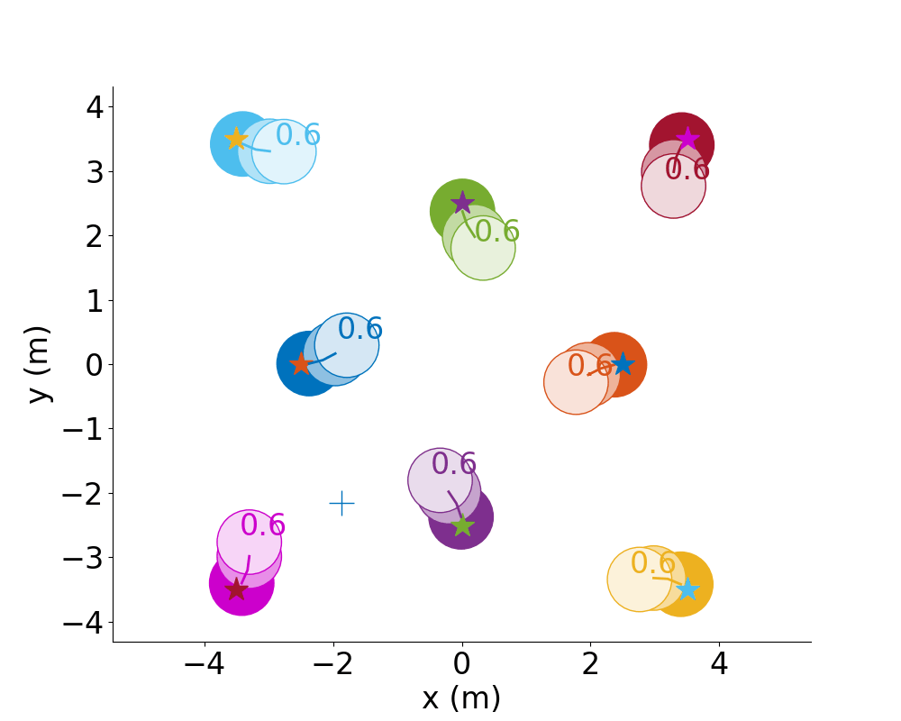

# Where to go next: Learning a Subgoal Recommendation Policy for Navigation Among Pedestrians



This repository will contain the code for the paper:

**<a href="https://arxiv.org/pdf/2102.13073.pdf">Where to go next: Learning a Subgoal Recommendation Policy for Navigation Among Pedestrians</a>**
<br>
<a href="http://www.tudelft.nl/staff/bruno.debrito/">Bruno Brito</a>,
<a href="http://mfe.mit.edu/">Michael Everett</a>,
<a href="http://www.mit.edu/~jhow/">Jonathan P. How</a>,
<a href="http://www.tudelft.nl/staff/j.alonsomora/">Javier Alonso-Mora</a>
<br>
Accepted for publication in [RA-L + ICRA 2021].

Robotic navigation in environments shared with other robots or humans remains challenging because the intentions of the surrounding agents are not directly observable and the environment conditions are continuously changing. 
Local trajectory optimization methods, such as model predictive control (MPC), can deal with those changes but require global guidance, which is not trivial to obtain in crowded scenarios.
This paper proposes to learn, via deep Reinforcement Learning (RL), an interaction-aware policy that provides long-term guidance to the local planner. In particular, in simulations with cooperative and non-cooperative agents, we train a deep network to recommend a subgoal for the MPC planner. The recommended subgoal is expected to help the robot in making progress towards its goal and accounts for the expected interaction with other agents. Based on the recommended subgoal, the MPC planner then optimizes the inputs for the robot satisfying its kinodynamic and collision avoidance constraints.
Our approach is shown to substantially improve the navigation performance in terms of
number of collisions as compared to prior MPC frameworks, and in terms of both travel time and number of collisions compared to deep RL methods in cooperative, competitive and mixed multiagent scenarios.

<div align='center'>
</img>
</div>

If you find this code useful in your research then please cite
```
@article{britogompc,
  title={Where to go next: Learning a Subgoal Recommendation Policy for Navigation Among Pedestrians},
  author={Brito, Bruno and Everett, Michael and How, Jonathan and Alonso-Mora, Javier},
  journal={IEEE Robotics and Automation Letters},
  year={2021},
  publisher={IEEE}
}
```
